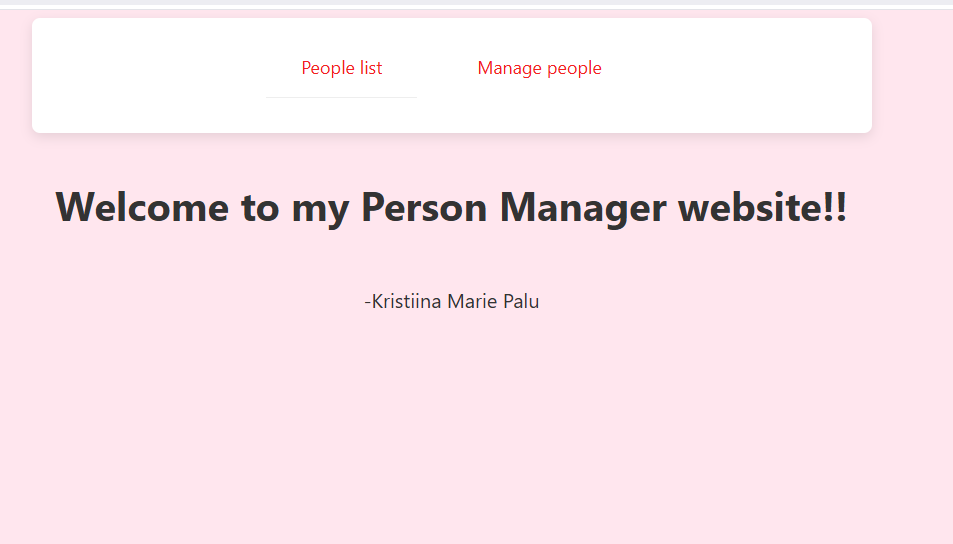

# Person Manager Webpage

Hello!  
My name is Kristiina, and this is my completed Person Manager webpage assignment.  
While I initially had limited experience with Spring Boot Java, and Docker, 
I worked hard to learn and apply these technologies. 
I hope my project meets your expectations and 
thank you for taking the time to review my assignment.

---

## How to Run the Project

Follow these steps to set up and run the webpage:

1. **Clone my GitHub project into an IDE**
   - Open the green code button and copy the link from HTTPS.
   - Open an IDE app (I used Intellij), and add new project from version control and paste the link into the URL.

2. **Java Version**
    - Make sure you have Java 17 installed and in the project.
    - ```bash
      java --version
    - If not, open project structure, project and change the version to 17.

3. **Sync Gradle Project**
    - Locate `build.gradle` and click "Sync Gradle".

4. **Run the following command to check if node.js is downloaded**
   - ```bash
     node --version
   - If it is not yet downloaded, go to this page and download it: https://nodejs.org/en/download

5. **Open the nginx.conf file and check, if the plugin is downloaded**
   - If not, install the plugin

6. **Start Docker Desktop**
    - Make sure Docker Desktop is running.

7. **Verify Docker Installation**  
   Open the terminal and run:

   ```bash
   docker --version

8. **Build the docker containers**  
    Open the terminal and run:

   ```bash
   docker docker compose up --build 

9. **Ensure, that the docker containers are visible and active in Docker desktop**

10. **Open http://localhost:3000/**

## This is how the first page should look like, after initially opening it

## Project structure

My project is composed of a backend part, frontend part, database and docker.
 1. **Backend**: Java Spring Boot (Inside the src file):
      - **WebConfig** - Allows my backend to talk to my frontend, without blockage from CORS(Cross-Origin Resource Sharing)
      - **PersonController** - This allows my frontend to get access to adding, removing and getting people.
      - **Person** - This is my person entity, which will automatically save it into my database table
      - **PersonRepository** - This provides CRUD operations (Create, Read, Update, Delete) for my Person entity,
         allowing me to interact with the person in the database.

 2. **Frontend**: React.js with CSS styling
       - **App.js** - This is my first welcoming homepage, with the navbar code.
       - **PeopleList.js** - This is a page, where you can look at all the people in the database, search them by name
          and sort them alphabetically.
       - **ManagePeople.js** - This is a page, where you can remove and update people by ID and add people.
       - **Index.css** - A file with all of my styling information for the webpage
 3. **Database** - PostgreSQL
      - My database saves the person entity and allows me to update the people in the list and save all the information into 
        the database
 4. **Docker containers**
      - I have 3 different Docker files. I have a frontend Dockerfile in my person-manager-frontend directory,
         I have one in the root for my backend and a final one, which generates 3 docker containers automatically for
         frontend, backend and database.

### Thank you for giving me a chance to show my skills! 
- I am open to feedback and would be happy to answer any questions you might have!
